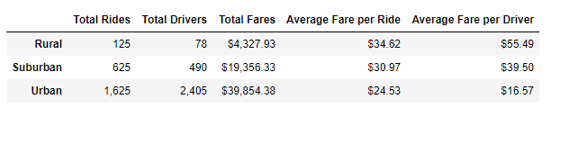
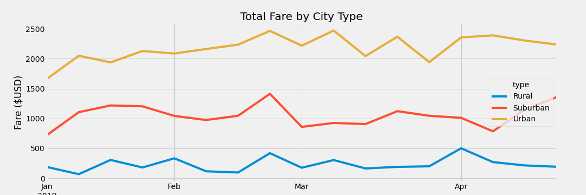

# PyBer_Analysis
## Overview
My new boss at PyBer has given me a brand-new assignment. I have been asked to create a summary DataFrame of the ride-sharing data by city type. Then, using Pandas and Matplotlib, I will create a multiple-line graph that shows the total weekly fares for each city type. I will ultimately summarize how the data differs by city type and how those differences can be used by decision-makers at PyBer.
## Data
### Background
 - After downloading and merging two data files (city data and ride data), the following analysis was completed to attain this summary chart for the Urban, Suburban, and Rural city types: 
   - Number of rides by city type
   - Total ride count by city type
   - Total drivers by city type
   - Total fare by city type
   - Average fare per ride per city type
   - Average fare per driver per city type

## Results
The next step was to filter the data to look at 01-01-2019 through 04-29-2019 and resample the data by week. The following graph was created as a result. 

### Analysis
#### Summary 
The difference in ride-sharing data among the different city types is drastic.  Rural areas have less requested rides (125) and less drivers (78) compared to Suburban and Urban areas. The Urban areas have the largest number of requested rides (1,625) and also drivers (2,405).  However, the most expensive Average Fare per Ride and Average Fare per Driver are seen in the Rural area at $34.62 and $55.49, respectively.  In turn, the Urban areas experience the least expensive Average Fare per Ride and Average Fare per Driver, at $24.53 and $16.57, respectively.  The Suburban results fall in the middle at 625 rides, 490 drivers, $30.97 Average Fare per Ride, and $39.50 Average Fare per driver.  An additional analysis that could be completed is looking at the driver to ride ratio. It appears there is almost 1.5x the drivers to rides taken in Urban areas, while there's 0.62 drivers to rides taken in Rural areas, which means there is more opportunity for the drivers in the Rural areas.
#### Total Fare by City Type
When looking at the graph, it is easy to see that the Urban Fares are highest, which is expected based upon the volume seen in the summary.  Likewise, the Rural areas experience less fares on average per week than both Urban and Suburban areas.

## Recommendation
Based on the results, I have three business recommendations for the CEO for addressing any disparities among the city types.  First, demand seems to be lowest in early January and mid-February (per Total Fare by City Type) in Rural areas. During those windows, perhaps drivers could be relocated to the Suburban and Urban areas where it appears demand is increasing during those periods.  Also, it appears, per Total Fare by City Type, that demand spikes in all three City Types so perhaps it is an opportunity to hire more temporary drivers during that time period to ensure customers are happy and not waiting too long for a ride. Finally, it appears the Urban area is a saturated market with there being 1.5x the amount of drivers to rides taken.  Even though it would dilute the Average Fare per Driver, perhaps some Urban drivers could be moved to Suburban and Rural areas to help with distribution of opportunity.

